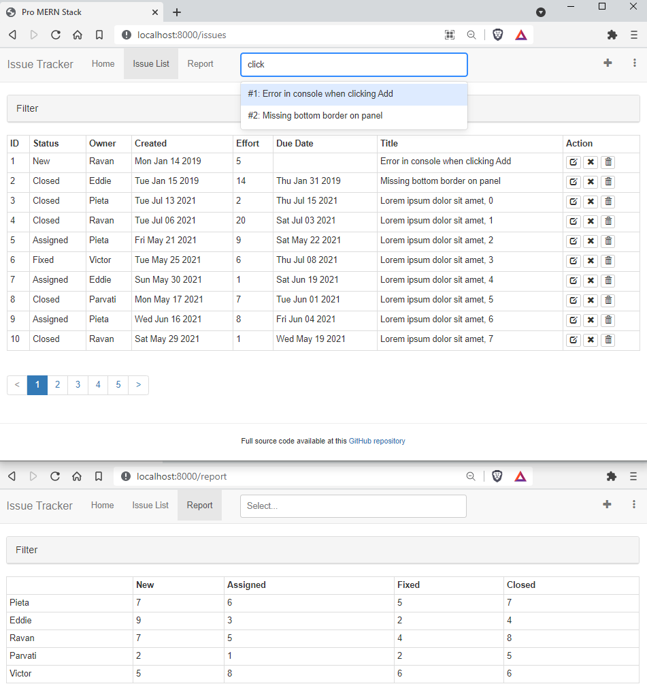

# JoffreyInocencio-IssueTracker

## ProMern Project

IssueTracker is a Full Stack Single Page Application that allows users to create issues or bugs, assign them to people, and track their statuses. These are essentially CRUD applications (Create, Read, Update, and Delete a record in a database) that manage a list of objects or entities. This project was built as part of a Web Development graduate course using the Pro MERN textbook authored by Vasan Subramanian

- [Front-end](https://github.com/JoffreyCodes/tracker-ui)
- [Back-end](https://github.com/JoffreyCodes/tracker-api)
- [Code listing for the book Pro MERN Stack, 2nd ed](https://github.com/vasansr/pro-mern-stack-2)

To run this project, use command `npm start` in both ui and api directories.

# Chapter14 - Authentication

- Sign-in UI - Added a front-end only sign-in/signout button to our nav bar in `SignInNavItem.jsx`.
- Google Sign-In - Implemented Google sign-in in place of our sign-in ui from the previous section.
- Verifying the Google Token - Verified Google Sign-in credentials in the back-end and took the authenticated username and name to place in the front-end nav item.
- JSON Web Tokens - Implemented JSON Web Tokens as cookies to allow user sign-in credentials to persist upon page refresh.
- Signing Out - Implemented sign out by clearing the JWT cookie and removing the google authentication.
- Authorization - Implemented `mustBeSignedIn` API authorization functionality which forces a user to be signed-in inorder to interact with various CRUD-API calls in `api/issue.js`."
- Authorization-Aware UI - Disabled the create issue button if a user is not signed in.
- React Context - Disabled the issue open and issue close button on the issue table page and the issue submit button in the issue edit page when a user is not signed in.
- CORS with Credentials - Allowed credentials to be sent to the server for all GraphQL calls and enabled proxy mode of operation. Here cookies are being set via authentication response and sent to the API serve for `/auth` and `/graphql` calls.
- Server Rendering with Credentials - Implemented server rendering with authenticated user information. This effectively removes the screen flicker that temporailiy shows a user as signed out, when the are actually signed in.
- Cookie Domain - Allowed cookie domain for cross-site requests and changed our API and UI endpoint environmental variable to `promernstack.com`.

Chapter 14 was straightforward to follow, however somewhat difficult to understand. A more visual approach to understanding how JWT, cookies and cors are overlayed accross the UI, API, and Google developer would of been helpful to further drive our understanding of the material.

# Chapter13 - Advanced Features

- Higher Order Component for Toast - Moved Toast components into a higher order component by create a wrap around `IssueEdit` `IssueList` and `IssueAddNavItem`.
- MongoDB Aggregate - Instatiated randomized issues to our mongoDB
- Issue Counts API - Implmented an Issue Counts API where we return a count of the number of issue status' noted per owner
- Report Page - Implemented the report page in `IssueReport.jsx`.
- List API with Pagination - Implemented pagination for the API only. Pagination is not yet reflected in the UI.
- Pagination UI - Implemented pagination for the UI in making changes in `IssueList`.
- Undo Delete API - Implemented in `issues.js` the restoration of deleted issues by taking issues in the `deleted_issues` collection back to the `issues` collections.
- Undo Delete UI - Implemented the undo button in a toast message upon deleting an issue.
- Text Index API - Implemented text indexing in our database and API call for the search.
- Search Bar - Integrated the Text Index/Search API into our UI via searchbar.

Chapter 13 was straightforward to follow. No challenges were encountered.

# Chapter12 - Server Rendering

- New Directory Structure - Reconfigured ui directory with ui-server and ui-browser specific folders, added corresponding linters and rerouted paths.
- Basic Server Rendering - Implemented the About page in which the HTML is rendered on the server instead of the DOM using `ReactDOMServer.renderToString()`.
- Webpack for the Server - Implemented changes that allow Webpack to compile our `About.js` page to `About.jsx`.
- HMR for the Server - Created a Webpack configuration that enables HMR for the server. Note: On a Windows PC, you may need to create your own batch file with equivalent commands or execute `npm run watch-server-hmr` and `npm start` on different command windows.
- Server Router - Implemented `StaticRouter` in `render.jsx` which in turn rendered in the server our About page with navigation.
- Hydrate - Attached event handle scripts in `template.js`. Reokaced `render()` with `hydrate()` is the recommended way to rendering attached event handlers to the server-rendered DOM.
- Data from API - Implemented data requests from the API server as well as implemented a global store in `store.js` so that we can pass down information while a component is being rendered.
- Syncing Initial Data - Made changes that made browser rendering identical to server rendering.
- Common Data Fetcher - Added data fetcher for the About component using `componentDidMount()` in `About.jsx` and rendering thereafter in `render.jsx`.
- Generated Routes - Removed hard-coding of fetched data and replaced with route paramaters.
- Data Fetcher with Parameters - Implemented `IssueEdit` component to render from the server with the data that it requires prepopulated.
- Data Fetcher with Search - Implemented data fetcher for the `IssueList` component.
- Nested Components - Modified the component `IssueList` to render its contained detail only.
- Redirects - Implemented request to home page `/`.

Although not stated by the author, clearing the dist folder seemed to remove much of the issues i was facing (i.e my page would hang upon refreshing for no reason in particular that had to do with my written code). It seems that when changes are made, webpack-server-hmr is not updating the files to reflect the changes that were being made in following the chapter guide.

# Chapter11 - React-Bootstrap

- Bootstrap Installation - Installed `bootstrap` and `react-bootstrap`. Then we confirmed installation was successful by linking `bootstrap` font changes in `index.html` and adding a `title` tag in `issueList.jsx`.
- Buttons - Replaced close and delete buttons with bootstrap buttons/icons. Additionally we added an `OverlayTrigger` to inform the user of the button action after hovering over the button.
- Navigation Bar - Replaced the navigation elements and page title with React-Bootstrap `Navbar` style.
- Panels - Placed filter criteria into a react-bootstrap panel and fixed page margins by wraping the body of our page with `<Grid>`.
- Tables - Changed table style to a react-bootstrap table. Replaced select button with clicking on a row to show issue description.
- Forms - Changed the filter form to follow `<FormGroup>`.
- The Grid System - Applied the react-bootstrap grid system to the Filter panel.
- Inline Forms - Applied react-bootstrap `inline` form controls to our add issue form.
- Horizontal Forms - Applied form control to our issue edit page.
- Validation Alerts - Replaced validation alert with bootstrap `Alert` in our issueEdit component.
- Toasts - Replaced alerts in the UI with Toast messages.
- Modals - Moved the issue-add form to the header using `Modals`. Subsequently we removed `IssueAdd.jsx` and its corresponding components in `IssueList.jsx` and `Page.jsx` onto placed modal-based components in `IssueAddNavItem.jsx`.

Following the instructions for form controls and modals was somewhat confusing to follow. My preference is to edit the code by retaining as much as possible and rewriting the necessary changes as described. Rather, the author's writing style seemed to encourage direct copy-pasting "for the sake of brevity", more so than usual when compared to previous sections.

# Chapter10 - React Forms

- Controlled Components - Added the currently active filter to be displayed when page is refreshed. This was done by setting the value of the input (taken from the URL via `url-search-params`) to the state or props variable(setting `<select value=params.get('status')>`).
- Controlled Components in Forms - Implemented `showOriginalFilter` and `applyFilter` functionality such that the filter status information is retained to the state.
- More Filters - Added a filter on the Effort field API in `schema.graphql` and retrieval logic in `issue.js`.
- Typed Input - Added typed user-input boxes for `effortMin` and `effortMax` by defining `effortMin` and `effortMax` as state variables, which we used parse through the URL. We also forced interger inputs into the input box using regex in `onChangeEffortMin` and `onChangeEffortMax`.
- Edit Form - Added edit-form functionality to the edit page. Here we take each issue's state variables and default these values as user inputs to the corresponding fields in the table-based form.
- Number Input - Handled number input for the `Effort` field in the edit page using specialized input components. This was done by only allowing the state to change upon checking for valid input digits in our `onChange()` method.
- Date Input - Added date input validation for the 'Due" field in the edit page. This was done by checking whether the date-input matches a specified integer format after the user is done typing.
- Text Input - Added text input to handle null values for text input fields in the edit page.
- Update API - Implemented our issue-update `Mutation` in `schema.graphql`.
- Updating an Issue - Connected changes made in the edit form to be reflected on MongoDB database.
- Updating a Field - Added a Close button in our Action column that changes the status of an issue to "Closed".
- Delete API - Implemented our issue-delete `Mutation` in `schema.graphql`.
- Deleting an Issue - Added a Delete button in our Action column that changes removes the issue from being displayed on the table.

Among the input validation sections, I did not quite understand the purpose or intent behind `onBlur()` such that they needed to be apart from the `onChange()` methods.

# Chapter9 - React Router

- Simple Routing - Added routing to our page using React Router which was implmented in `Contents.jsx`. Additioanlly we added a placeholder for an Issue Report page for the report view.
- Route Parameters - Added an edit column for each issue entry in `IssueTable.jsx` which links to an edit page that currently serves as a placeholder. This was implemented in `IssueEdit.jsx`.
- Query Parameters - Implemented a queryn-based filter for the status type of our issues which was accomplished using `URLSearchParams`. Additionally, we implemented the lifecycle hook `componentDidUpdate` to reload our data by calling `loadData()` when a change occurs when comparing the `location.search` property of the previous and current props.
- Links - Replaced `href` elements with react-based `Link` components.
- Programmatic Navigation - Rather than utilizing a predetermined string implemented previously in our `Link` components, we changed our issue filter navigation method to a drop down style by taking the `onChange` property within a `<select>` element and pushing that value into our query string. Altogether bringing a dynamically-constructed string query for our navigation implementation.
- Nested Routes - Implemented description feature om `IssueDetail.jsx` for each issue and added initial descriptions to `init.mongo.js`. This was implemented via nested routes where selecting an issue gives us a path. This path delivers a route to the description which is rendered and displayed on the same page.
- Browser History Router - Switched from `HashRouter` to `BrowserRouter` to make our application search engine friendly.

Although not difficult to implement, I found the last section, Browser History Router" difficult to understand and was not able to replicate the sccenario described when HMR fails.

# Chapter8 - Modularization and Webpack

- Back-End Modules - Modularized `server.js` to new files `about.js`, `api_handler.js`, `db.js`, `graphql_date.js`, `issues.js` with respective functionality. This was accomplished by via `module.exports`.
- Front-End Modules and Webpack - Modulated `graphQLFetch` from `App.jsx` to `graphQLFetch.js` using the Webpack tool which determined the dependency. Additionally, it is important to note that webpack automatically figured out that `App.js` depends on `graphQLFetch.js` due to the import statement and has included it in `app.bundle.js`.
- Transform and Bundle - In this section, we transformed and bundled the various functions in `app.jsx` to seperate, respective files `IssueAdd.jsx`, `IssueFilter.jsx`, `IssueList.jsx`, and `IssueTable.jsx`. This was accomplished using Webpack which we configured to Babel transform, and bundle our jsx files into `app.bundle.js`.
- Libraries Bundle - Using Webpack, we bundled all the third-party libraries together in `vendor.bundle.js` which in turn removes the need for the libraries to load from a Content Delivery Network (CDN).
- Hot Module Replacement - Implemented Hot Module Replacement(HMR) which mimics `npm run watch`. Instead, HMR allows us to make code changes to specific modules in the browser while the application is running, without having to refresh altogether.
- Debugging - Enabled Webpack devtools in `webpack.config.js`.

Chapter 8 was straightforward. No particular challenges were encountered.

# Chapter7 - Architecture and ESLint

- UI Server - Seperated UI and API components to be handled seperately in different servers to allow greater scalability of our app.
- Multiple Environments - Here we set up enviromental variables for our Server and UI ports by creating respective `.env` files in both ui and api folders.
- Proxy-Based Architecture - Changed requests to /graphQL to route to the API server by implemting a proxy-based architecture and enabling cross-origin resource sharing (CORS)
- ESLint - Installed and ran ESLint in the api folder. Problems identified by the linter were addressed. Added ESLint as a dependency.
- ESLint for the Front-End - Installed and ran ESLint in the ui folder. Problems identified by the linter were addressed. Added ESLint as a dependency.
- React PropTypes - Added PropTypes-based validation for `IssueAdd` to ensure that passed-in parameters are validated against a `createIssue` prop specification.

In chapter 7, interacting with the command line to initiate different environments was at first confusing and not explicitly clear in the book. Secondly, as it was not mentioned in the book, I had to indicate a direct path in `require('dotenv').config({ path: 'sample.env' });` to resolve an "unidentified" `UI_API_ENDPOINT` error I encountered when loading the ui webpage.

# Chapter6 - MongoDB

- MongoDB Node.js Driver - We tested our connection to a local mongoDB server in `trymongo.js`.
- Schema Initialization - Created an initialization script for our issues tracker database called `issues`. Then we initialized `issues` with two documents to populate our database.
- Reading from MongoDB - We changed the List API to read from the MongoDB rather than the in-memory array of issues in the server.
- Writing to MongoDB - Added functionality that allowed us add new issues using the issuesTracker UI and having the data persist in MongoDB with unique IDs.

Nothing was particularly challenging about this chapter.

# Chapter5 - Express and GraphQL

## Express

- Include Express description here
- More information on Express can be found on Pro MERN pg.9

## GraphQL

- The About API - Using GraphQL, we implemented an API call to change a string message. This API will soon be used to make user-modifications for our Issues Trackers.
- GraphQL Schema File - Here we seperated graphql code from `server.js` and moved it to `schema.graphql`.
- The List API - Here we declared our `issueList` in our `Query` which called on our hard-coded (temp) `issuesDB`. As a result in the Apollo Playground, we were able to query subfields within `issuesDB`.
- List API Integration - We integrated the above API query to the issues tracker UI by replacing state components in `loadData` with a GraphQL query.
- Custom Scalar Types - Here we customized the date from (`new Date()`) to `scalar GraphQLDate)` for user's timezone. To utilize this customization, we added a resolver to handle serialization of the `GraphQLDate` value via `.toISOString() ` on the way in, and parsing via Regex back to `new date(value)` on the way out.
- The Create API - Using our API integration, we created an `issueAdd` feature which created an issue in the server, and in turn to be appended as a new issue to the database. This approach was modeled after the `setAboutMessage` we created in the schema `Mutation`.
- Create API Integration - Added a default due date to be 10 days in advance of the issue creation date. This was implemented by executing an asynchronous `fetch` call to our `query` which held the properties of a passed-in issue object.
- Query Variables - To account for dynamic-based user input (i.e. special characters and double quoted descriptions), we introduced variables for graphQL to factor dynamic values out of the query by specifying the `issue` as the variable in the body of our `fetch` request.
- Input Validations - Added programmmatic validations and proper validation of GraphQLDate type. This was accomplished by defining `StatusType` enums of accepted types.
- Displaying Errors - Implemented feature to show error messages to the user by using `alert(error.message)`. Here we try/catch errors due to network connection probelms and invalid user inputs.

Implemented chapter 5 was much longer and more extensive than previous chapters, considering the author covers REST and GraphQL API standards. The actual implementation of the API into the UI was meticulous and came across numerous syntactical errors if I was not careful to pay attention. It was also confusing taking our query between JSON and string, which in turned was parsed back to json, to later then turn the entire query into a variable. The graphQL playground seems helpful, but am somewhat unsure how to use it for debugging purposes.

# Chapter4 - React State

- Initial State - Here we changed our array of issues to React _state_ components. This allows user edits to be made without having to rerender or recompile the entire project.
- Async State Initialization - In this section we simulated an asyncronous call to our hard-coded data using the React lifecycle method `componentDidMount()`.
- Updating State - Rather than using `this.setState()` to add or make a change to the entirety of our state( the issues array), we introduced a change to a portion of our state (adding a new issue) by copying our state using the `.slice()` method.
- Lifting State Up - Here we move our timer induced `createIssue(sampleIssue)` method from IssueTable to IssueAdd. Additionally, we moved associated creation methods from IssueTable to the parent, IssueList. This was accomplished by binding via `<IssueAdd createIssue={this.createIssue.bind(this)} />`
- Event Handling - Instead of using a timer to submit an issue, we added a button to handle the issue submission event given by user input form box.
- Stateless Components - Since `IssueRow` and `IssueTable` components both call `render()`, we optimized this by changing these components into functions.

I found implementing chapter 4 to be more straight forward. Nothing in particular was challenging as far as following the exercises. However, it seems that the there may be much more to the life cycle methods and that this chapter only gave us a glimpse of their uses. Secondly, the use of states and props is still a little ambiguous. However, the summary at the end of the chapter was somewhat helpful.

# Chapter3 - React Components

In chapter 3, we learned to work with React components and began initial work on our Issue Tracker. Using hard-coded data, we learned how to pass parameters of enclosing components to children components, thereby building our React component composition. In this sense, we gain the ability to reuse react components in our code. In achieving this functionality, we moved away from rendering a “hello world” message to rendering a table via dynamic composition to form the basis of an issue for our issue tracker

Given the limited scope (thus far) in applying React Components, I found the reading in this chapter particularly challenging. Overall, I am unsure how these react components behave functionally outside of this project design.

# Chapter2 - Hello World

We initialized the book project using Node.js and Node Package Manager (npm). In tandem, we built a simple hello world application using React. We also learned to use Babel to help us transform JSX into pure JavaScript. At this point, the application functions by taking a React JSX “Hello World” code and serving this file to a local server. The jsx file calls a ReactDOM.render() function that takes in an element to render and display. Lastly, the element rendered is our concatenated “hello” message to various continents of the world.

Challenges in this chapter was acquainting myself with the methodology of how the author describes the implementation. For example, I was unsure most of the time of where a code snippet should belong in a file. It was only made clear towards the end of the section where the entire code file was shown as a figure or by referencing the authors GitHub repository.

